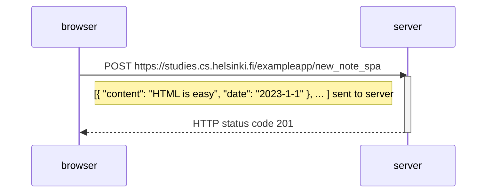

```mermaid

sequenceDiagram
    participant browser
    participant server
   
    browser->>server: POST  https://studies.cs.helsinki.fi/exampleapp/new_note_spa
    activate server
    Note right of browser: [{ "content": "HTML is easy", "date": "2023-1-1" }, ... ] sent to server
    server-->>browser: HTTP status code 201
    deactivate server
```